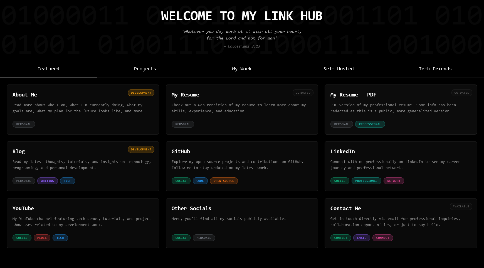

# My Hub - Personal Link Hub

A modern, responsive link hub to showcase your personal projects, work experience, self-hosted services, and connections. Built with HTML, CSS, JavaScript, and containerized with Docker for easy deployment.

## [Demo](https://zachl.tech/link-hub/)



## 🚀 Features

- Clean, responsive design optimized for all devices
- Tab-based navigation for different content categories
- Customizable card layout for displaying links
- Status badges to indicate project state
- Color-coded tags for categorization
- Easy to customize and extend
- Docker-ready for simple deployment

## 🛠️ Technology Stack

- HTML5, CSS3, and vanilla JavaScript
- TailwindCSS for styling
- NGINX as web server
- Docker for containerization

## 📁 Project Structure

```
my-hub/
├── public/                 # Static files served by NGINX
│   ├── assets/
│   │   └── links.json      # All link data stored here
│   ├── index.html          # Main HTML structure
│   ├── styles.css          # Custom styling
│   └── scripts.js          # JavaScript functionality
├── nginx.conf              # NGINX configuration
├── Dockerfile              # Docker build instructions
├── docker-compose.yml      # Docker Compose configuration
└── .env                    # Environment variables
```

## 📝 The links.json Structure

The `links.json` file is the heart of this project. It contains an array of objects, where each object represents a link card with the following structure:

```json
{
    "title": "Project Name",
    "description": "A brief description of the project or link",
    "tags": [
        {"name": "Tag1", "color": "blue"},
        {"name": "Tag2", "color": "green"}
    ],
    "status": "Active",
    "link": "https://yourproject.com",
    "section": "projects"
}
```

### Fields Explained

- **title**: Name of your project or link
- **description**: Brief description displayed on the card
- **tags**: Array of tag objects with:
  - **name**: Tag text
  - **color**: Color scheme (options: blue, purple, green, teal, pink, orange, yellow, red, default)
- **status**: Current project status (options: Active, Development, Inactive, Archived, or any custom text)
- **link**: URL to navigate to when clicked
- **section**: Tab where this card should appear (options: featured, projects, work, self-hosted, friends)

## 🔧 Customization

### Modifying Links

The easiest way to customize this project is by editing the `public/assets/links.json` file. Add, remove, or modify entries as needed.

### Changing Tabs

To modify the tabs:

1. Edit the tab links in `public/index.html`:
```html
<a href="#tab-name" class="tab-link">Tab Display Name</a>
```

2. Add corresponding content container:
```html
<div class="hidden min-h-full" id="tab-name-content">
    <div class="grid grid-cols-1 md:grid-cols-2 lg:grid-cols-3 gap-4 md:gap-6" id="tab-name-container"></div>
</div>
```

3. Make sure your links in `links.json` have the correct `section` value to match your tab name

### Styling

Modify `public/styles.css` to customize the appearance. The project uses Tailwind CSS for most styling, with custom CSS for specific components.

## 🏗️ Setup and Deployment

### Prerequisites

- Docker and Docker Compose installed

### Local Development

1. Clone the repository & switch to this branch:
```bash
git clone https://github.com/ZachLTech/website-hub.git
cd website-hub
git checkout minimal
```

2. Customize `public/assets/links.json` with your own links

3. Set the desired port in the `.env` file:
```
PORT=9795
```

4. Build and run the container:
```bash
docker-compose up -d
```

5. Access your link hub at `http://localhost:9795` (or whatever port you specified)

### Production Deployment

For production, you might want to:

1. Set up a domain name and configure it to point to your server
2. Use a reverse proxy like Traefik or Caddy to handle SSL
3. Ensure proper security measures are in place

Example deployment with docker-compose:

```bash
docker-compose up -d --build
```

